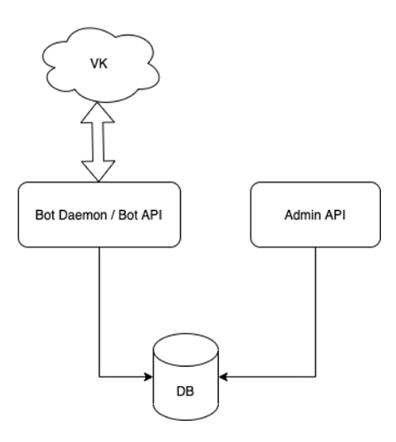
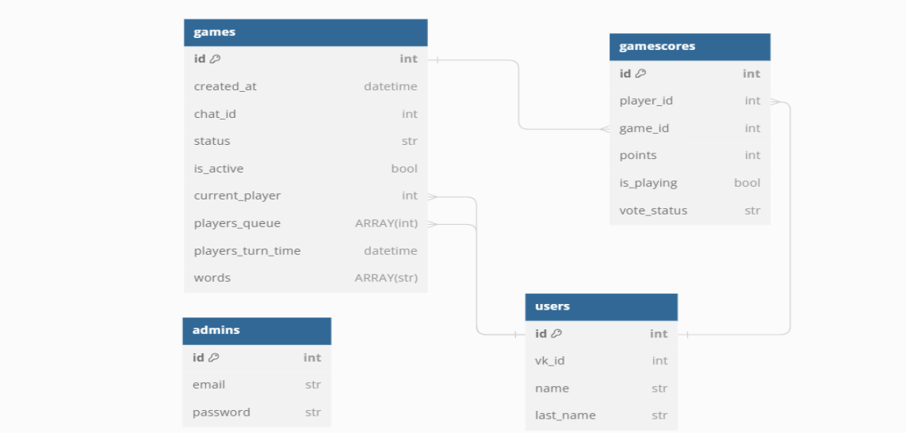

# WordGameBot VK
 Данынй проект является итоговым проектом в школе KTS

## Цель
Реализовать бота для игры в словаКомпоненты:
- `VK Poller` - слушает события из VK и передаёт их `Bot manager`
- `Bot manager` — обрабатывыет передынные события
- `Admin API` — API для управления игрой

### Схема БД

### API
- `/admin.login` - авторизация администратора
- `/admin.current` - получение текущего администратора
- `/word.add_word` - добавление слова в вокабуляр бота

### Демонстрация игры

## Стэк
- Aiohttp
- PostgreSQL